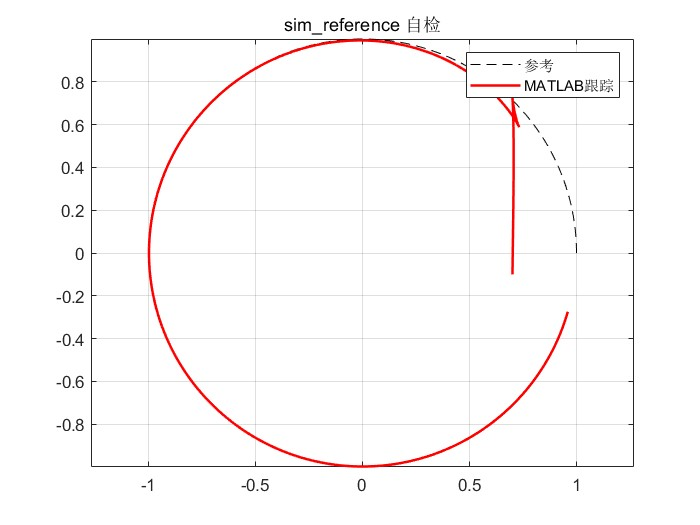

<div align="right"><a href="#中文">中文说明 ↓</a></div>

# Backstepping Trajectory Tracking — STM32 Hardware-in-the-Loop

A nonlinear **backstepping** trajectory-tracking controller, ported from MATLAB to an
STM32F103, running **hardware-in-the-loop (HIL)**: the controller and an Ackermann
kinematic model run in real time on the MCU, a real **servo** outputs the commanded
front-wheel angle, an **OLED** draws the reference vs. tracked path, and the data is
streamed over **UART** and compared against a MATLAB reproduction.

## Highlights
- **Globally asymptotically stable** — based on Lyapunov design, no linearization,
  so it converges from arbitrarily large initial error (unlike linearized/PID schemes).
- **Measured**: steady-state tracking error **< 1.5 cm**, converges in **~3 s**;
  under a 2 m initial-error stress test it still converges within ~3 s.

## Results
| Tracking compare | Tracking error | MATLAB reproduction |
|---|---|---|
|  |  |  |

## Wiring (Alientek STM32F103 mini)
| Peripheral | Pin |
|---|---|
| Servo signal | PA8 (5V power, common ground with board) |
| Rotary encoder A/B (live speed tuning) | PA6 / PA7 |
| OLED SCL / SDA | PC10 / PB15 |
| UART TX / RX | PA9 / PA10 (115200) |

## Build & Run
1. Open `Keil Project/Template Project.uvprojx` in Keil MDK, build & flash.
2. Open the COM port at 115200 8N1, log output to `stm32_log.csv`.
3. In `MATLAB Script/`, set the initial state in `sim_reference.m` to match the flash,
   then run `compare_stm32_vs_sim.m` to overlay STM32 vs MATLAB and print the metrics.

## Layout
```
Keil Project/User/   controller.c/h, servo.c/h, main_hil.c + drivers
MATLAB Script/       sim_reference.m, compare_stm32_vs_sim.m, stm32_log.csv (sample)
images/              result screenshots
```

---
<a name="中文"></a>

# 反步法轨迹跟踪 — STM32 硬件在环(HIL)

将 MATLAB 设计的**反步法(Backstepping)非线性轨迹跟踪控制器**用 C 移植到 STM32F103，
以**硬件在环(HIL)**方式运行：控制器与阿克曼运动学模型在 MCU 上实时运行，**舵机**实物
输出前轮转角，**OLED** 实时绘制参考/跟踪轨迹，**串口**回传数据并与 MATLAB 复现对比。

## 亮点
- **全局渐近稳定** —— 基于 Lyapunov 设计、无线性化近似，任意初始误差均收敛
  （传统线性化/PID 在大误差下会发散）。
- **实测**：稳态跟踪误差 **<1.5cm**，约 **3s** 收敛；2m 初始误差压力测试仍 ~3s 收敛。

## 效果图
| 轨迹对比 | 跟踪误差 | MATLAB 复现 |
|---|---|---|
|  |  |  |

## 接线（正点原子 STM32F103 mini）
| 外设 | 引脚 |
|---|---|
| 舵机信号 | PA8（5V 供电，与板共地） |
| 旋转编码器 A/B（实时调速） | PA6 / PA7 |
| OLED SCL/SDA | PC10 / PB15 |
| 串口 TX/RX | PA9 / PA10（115200） |

## 编译与运行
1. Keil 打开 `Keil Project/Template Project.uvprojx`，编译烧录。
2. 串口助手 115200 8N1 打开 COM，保存日志为 `stm32_log.csv`。
3. 进 `MATLAB Script/`，把 `sim_reference.m` 初始状态改成与烧录一致，
   运行 `compare_stm32_vs_sim.m` 叠加 STM32 与 MATLAB 并打印指标。

## 算法简述
误差转到车体坐标系 → 基于 Lyapunov 反推线速度 v 与角速度 ω 控制律 →
由自行车模型 ω=(v/L)·tan(δ) 逆解前轮转角 δ → 输出舵机；含速度饱和与前轮 ±45° 限幅。
通过修改参数 k1, k2, k3, k4 即可调整控制效果

## 目录结构
```
Keil Project/User/controller.c/h（控制器）、servo.c/h（舵机）、main_hil.c（主程序）+ 驱动
MATLAB Script/sim_reference.m（复现）、compare_stm32_vs_sim.m（对比）、stm32_log.csv（示例）
images/效果截图
```

> 说明：演示用半径 1m 的圆轨迹，让 STM32 与 MATLAB 完全对齐以验证控制器一致性；
> 控制器本身对任意可微轨迹通用。
